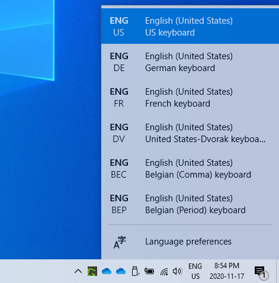
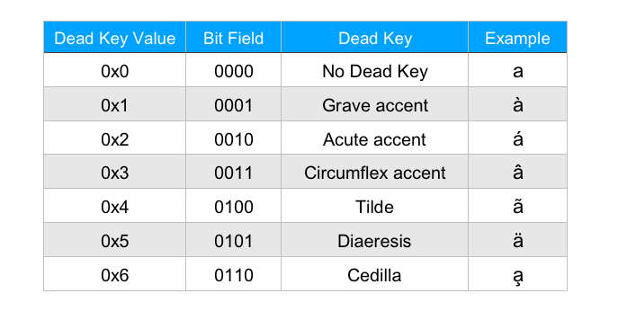
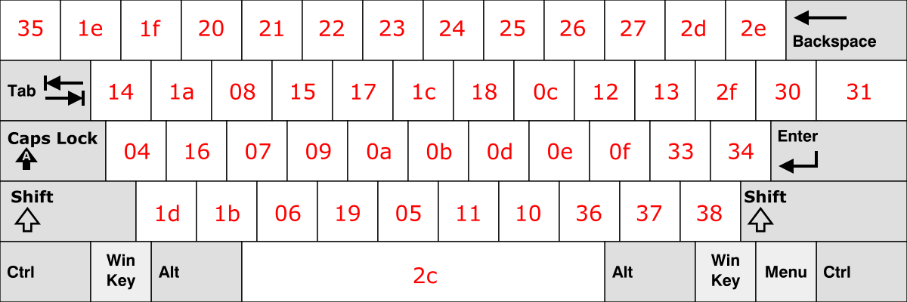
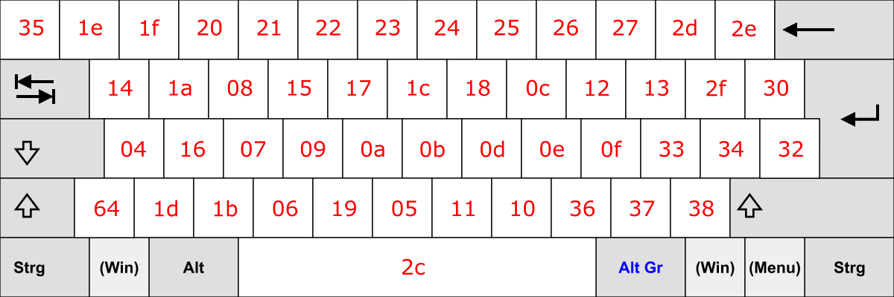
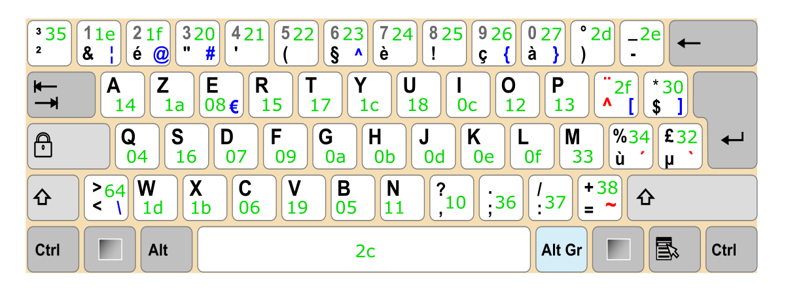
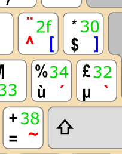

# Making Your Own Keymap

[Get duckyPad](https://www.tindie.com/products/21984/) | [Official Discord](https://discord.gg/4sJCBx5) | [Getting Started](getting_started.md) | [Table of Contents](#table-of-contents)

This guide describes how keymap works, and how to write your own.

Note that I'm no expert on keyboard technicalities, I barely got this thing to work! So [feel free to correct me](#questions-or-comments) if you spot anything wrong.

## (Short Story of) HID Usage ID

When you press a key, you keyboard sends a **`USB HID Usage ID`** to the computer, so it knows which key is pressed.

Each key has a unique HID Usage ID, you can [find a list here](https://gist.github.com/MightyPork/6da26e382a7ad91b5496ee55fdc73db2).

duckyPad works by acting as a regular USB keyboard, and sending HID Usage IDs to simulate keypresses.

## Keyboard Layouts

The kicker is, HID Usage ID corresponds to the `PHYSICAL LOCATION` of a key on the keyboard, NOT what it says on the key itself!

For example, here is a `ANSI QWERTY keyboard (US)`, very popular in US and other parts of the world.

* The red number is the HID Usage ID (in hexadecimal) that will be sent when pressed.


Now let's see what happens on a `Dvorak (US layout)` keyboard:


Notice how the **HID Usage ID stays the same** while **labels on the key change!**

Therefore, it is important to understand that the keyboard only tells `WHERE` a key is pressed, and it's **`up to the operating system`** to determine `WHAT` character the key should produce. In modern OSs, you can set multiple keyboard layouts:



## Keymap Madness

This creates an issue when it comes to input automation on duckyPad. Consider this command:

`STRING fox`

duckyPad will simply types out `fox`, but what code should it send? 

Remember that HID Usage ID (red numbers) corresponds to the `PHYSICAL LOCATION` of a key. So if we assume `English (US)` layout, it should send out `0x09, 0x12, 0x1b`:


However, if the OS is set to `Dvorak`, it will interpret `0x09, 0x12, 0x1b` as the keys at the `SAME LOCATION`, which comes out as `URQ`. Not good!


To type `fox` on `Dvorak`, duckyPad needs to send `0x1c, 0x16, 0x05` instead:


See the problem here? We now need to send **different codes** for the **same characters**! And there are *dozens* of keyboard layouts, each with their own minute quirks and differences.

To make sure everything works, we need a way to **`map a character to its HID Usage ID`** (and therefore the physical location on the keyboard) so duckyPad knows what code to send for different keyboard layouts.

And thus, the keymap is born.

## duckyPad Keymaps

Keymap for duckyPad is a simple text file mapping **`256 ASCII characters to HID Usage Codes`**.

### Examples

I have written a few myself, so [check it out here](sample_profiles/keymaps).

Here is a snippet from [`Dvorak (US)`](sample_profiles/keymaps/dpkm_Dvorak%20(US).txt) keymap:

```
.........
0x61 0x0004 // a
0x62 0x0011 // b
0x63 0x000c // c
0x64 0x000b // d
0x65 0x0007 // e
.........
```

### Basic Rules

* The file name must start with `dpkm_` and end with the extension of `.txt`.

* Inside, it should contain lines of **two hexadecimal numbers** (plus optional comment) like above.

* The first **2-digit hexadecimal number** is the [ASCII code of a character](https://www.ascii-code.com/).

* The second **4-digit hexadecimal number** is called a `duckcode`, which will be explained below.

### duckcode

duckcode is an `unsigned 16-bit number` containing the HID Usage Code and some other information:


* The `lower 8 bits` is the HID Usage Code, refer to the [keyboard diagrams above](#keyboard-layouts).

* `Bit 8` is `SHIFT`, set it to 1 to press it along with HID Usage Code. This is used for upper-case and symbols.

* `Bit 9` is `Alt Gr`, which produces additional characters on European keyboards, works the same way.

* `Top 4 bits` are for `Dead Keys`. They don't produce a character on their own, but modify the appearance of the next character.

* In this case, setting the appropriate bit adds accents on the base keys. It works like this:



## Making Your Own Keymap: Step-by-Step

### Download the templates

A good idea would be starting from templates.

[Click me to download the svg template](resources/keyboard_layout_graphics/ANSI_template.svg) for ANSI-style keyboard:



[Click me to download the svg template](resources/keyboard_layout_graphics/ISO_template.svg) for ISO-style keyboard:



* You can use [Inkscape](https://inkscape.org/) to open and edit svg files.

* There are multiple layers in the svg file, you can show or hide them.

* There are a few more svg files of different layouts, [check them out here](resources/keyboard_layout_graphics).

### Overlay the template

You can probably find a diagram of your desired keyboard layout [on Wikipedia](https://en.wikipedia.org/wiki/Keyboard_layout).

When you do, overlay the template over the layout to visualise the HID Usage Codes.

Let's say you want to make a keymap for `AZERTY Belgium` layout:



### Modify keymap entries

You can start from an [empty keymap](https://raw.githubusercontent.com/dekuNukem/duckyPad/master/sample_profiles/keymaps/keymap_template_empty.txt), or from the [default `English (US)` keymap](https://raw.githubusercontent.com/dekuNukem/duckyPad/master/sample_profiles/keymaps/keymap_template_eng_us.txt), or from a [similar existing layout](sample_profiles/keymaps). Either way, download and open it in a text editor.

For this example, we'll be starting from [`English (US)` keymap](https://raw.githubusercontent.com/dekuNukem/duckyPad/master/sample_profiles/keymaps/keymap_template_eng_us.txt).

Start from the top left key:


In `AZERTY Belgium` layout, when we press this key, it will print out `²` character.

Now we need to find it in the keymap file, and map it to the corresponding HID code.

Simply search `²` in the file, we find it at [line 185](sample_profiles/keymaps/keymap_template_eng_us.txt#L185). Its ASCII code is `0xb2`, and right now it looks like this:

`0xb2 0x0000 // ²`

The duckcode here is 0x0000, which means unmapped, since we don't have this key on US keyboards.

To map `²` to this key, make a duckcode as [described above](#duckcode). In this case, the HID code is `0x35` (shown on the key), and we don't need anything else, so the duckcode is `0x0035`. Change the line into:

`0xb2 0x0035 // ²`

That's it for this character!

---

However, we're not done yet! When you press this key with `SHIFT`, `³` is printed out.

As before, find `³` in the file, which is at [line 186](sample_profiles/keymaps/keymap_template_eng_us.txt#L186):

`0xb3 0x0000 // ³`

It is also currently unmapped. Since we need to press `SHIFT` to get this character, the `SHIFT` bit needs to be set in the duckcode, and it would be `0x0135`. Note how the HID Usage ID part stays the same.

So we change the line into:

`0xb3 0x0135 // ³`

Now this key is done! We mapped two characters to HID Usage IDs. Now duckyPad will know what code to send when it encounters those characters.

---

As another example, let's move on to the next key:


When you press this key, `&` will be printed out. Yes you heard that right, it is inverted in this layout!

It should be clear that duckcode for this character is `0x001e`.

As usual, go find `&` in the file, and set the duckcode:

`0x26 0x001e // &`

When you press this key with `SHIFT`, `1` is printed out. Therefore its duckcode should have the `SHIFT` bit set, which is `0x011e`. The line therefore should be:

`0x31 0x011e // 1`

However, we have a *third* character on this key! `|` is printed by pressing the `AltGr` key. So we need to set the `AltGr` bit in duckcode for this character, which would be `0x021e`.

Again, find the line and update the duckcode:

`0x7c 0x021e // |`

---

That's pretty much it! Now you just have to go through each key and check and modify the keymap lines!

Don't forget to set `SHIFT` bit for letter keys too, to distinguish between upper and lower cases.

### Dead Keys

To further complicate things, a lot of european keyboards include `Dead Keys`. They don't generate a character by themselves, but modify the appearance of the character typed immediately after.

In our Belgium keyboard example, there are 4 dead keys, identified with `red marking`.



If you press the top-left key marked with `^`, nothing will happen, but if you then press letter `a`, `â` will be generated instead.

If you want duckyPad to type characters with dead keys, you can specify them in the beginning of the keymap file like this:

```
dk_grave_accent 0x0232
dk_acute_accent 0x0234
dk_circumflex 0x002f
dk_tilde 0x0238
dk_diaeresis 0x012f
dk_cedilla 0x0000
```

The hexadecimal number is the duckcode for the dead key, and some of them will need `SHIFT` or `AltGr`.

If a dead key doesn't exist, set it to 0x0000.

Afterwards, [set the dead key bits in duckcode](#duckcode) with HID code of regular letters to get those letters with accents: 

```
0xd2 0x1112 // Ò
0xd3 0x2112 // Ó
0xd4 0x3112 // Ô
0xd5 0x4112 // Õ
0xd6 0x5112 // Ö
.....
0xf2 0x1012 // ò
0xf3 0x2012 // ó
0xf4 0x3012 // ô
0xf5 0x4012 // õ
0xf6 0x5012 // ö
```

To type symbols on the dead keys themselves, set the appropriate dead key bits along with HID code `0x2c`:

```
0x60 0x102c // `
0xb4 0x202c // ´
0x5e 0x0223 // ^
0x7e 0x402c // ~
0xa8 0x502c // ¨
```

Note that `^` has its own key, so you can use that instead.

You can take a look at the [completed `AZERTY Belgium` keymap here](sample_profiles/keymaps/dpkm_Belgium.txt).

## Test It Out!

Here are some duckyScript to test if your keymap is working properly.

Make sure to set the same keyboard layout on both duckyPad and your OS!

Check to see if duckyPad types everything out **exactly as it appears in the script**. If not, you might have made a mistake on that particular character.

### Letters and Numbers

```
STRING the quick brown fox jumps over the lazy dog
ENTER
STRING THE QUICK BROWN FOX JUMPS OVER THE LAZY DOG
ENTER
STRING 0123456789
ENTER
```

### ASCII Symbols

```
STRING !"#$%&'
ENTER
STRING ()*+,-./
ENTER
STRING :;<=>?@
ENTER
STRING [\]^_`
ENTER
STRING {|}~
ENTER
```

### Extended ASCII Characters

```
STRING €¡¢£¤¥¦§¨©ª«¬­®¯°±²³´µ¶·¸¹º»¼½¾¿ÀÁÂÃÄÅÆÇÈÉÊËÌÍÎÏÐÑÒÓÔÕÖ×ØÙÚÛÜÝÞßàáâãäåæçèéêëìíîïðñòóôõö÷øùúûüýþÿ
ENTER

```

Only characters that exists on the current keyboard layout will be typed out.

For example, if you run this on default `English (US)` layout, nothing will appear. Since none of those characters are on that keyboard layout.

## Good luck!

If you made a keymap for a new keyboard layout, feel free to sumbit a pull request or [contact me](#questions-or-comments), and I'll add it for everyone to use!

## Table of Contents

[Main page](README.md)

[Getting Started Guide](getting_started.md)

[Kit Assembly Guide](kit_assembly_guide.md)

[Using duckyScript](duckyscript_info.md)

[Common issues / Troubleshooting](troubleshooting.md)

[Firmware Updates and Version History](firmware_updates_and_version_history.md)

[Make Your Own Keymap](./keymap_instructions.md)

[Manual Setup](./manual_setup.md)

[Build a duckyPad Yourself](build_it_yourself.md)

[Kickstarter Backer Acknowledgments](kickstarter_backers.md)

## Questions or Comments?

Please feel free to [open an issue](https://github.com/dekuNukem/duckypad/issues), ask in the [official duckyPad discord](https://discord.gg/4sJCBx5), DM me on discord `dekuNukem#6998`, or email `dekuNukem`@`gmail`.`com` for inquires.
